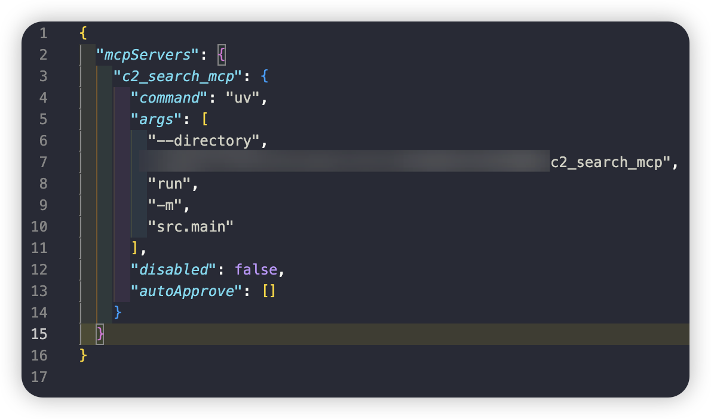
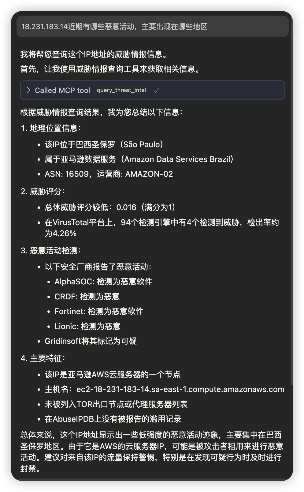
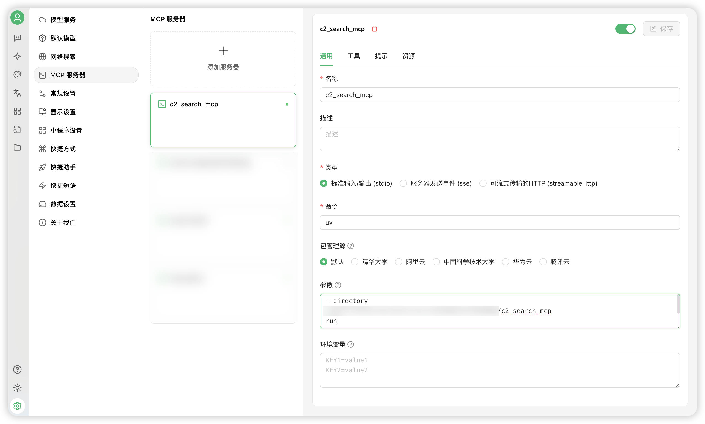
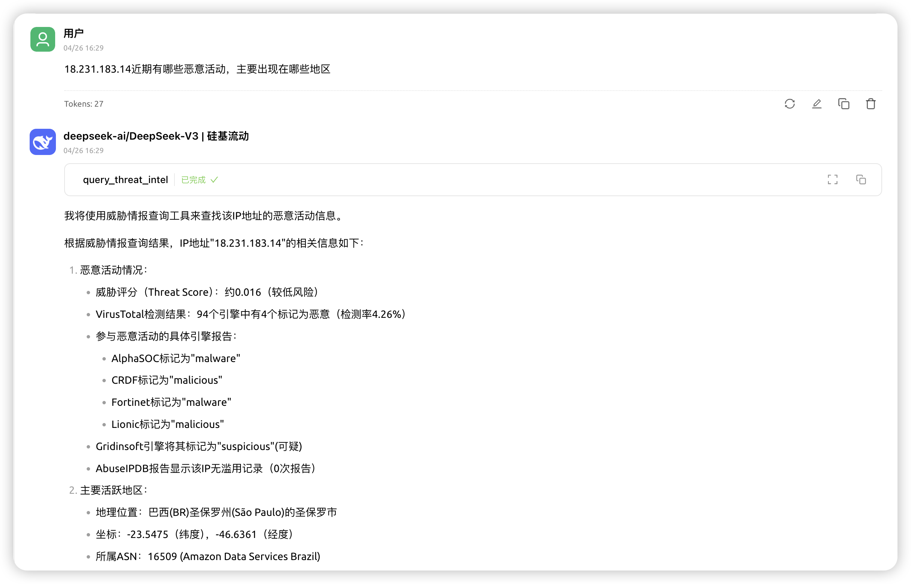
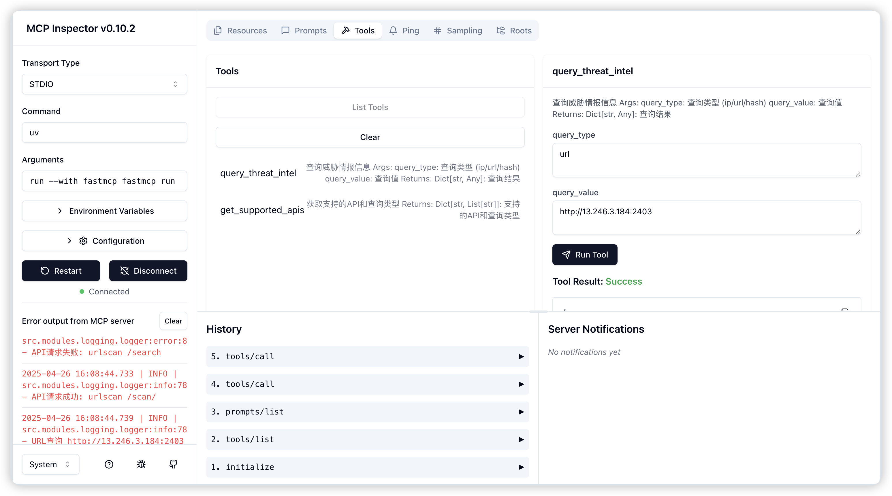

# Threat Intelligence Integration Query Service

[中文](README_zh.md) [English](README.md)

## Project Overview

This project is a threat intelligence integration query service based on FastMCP, supporting queries for threat intelligence data such as IP addresses, URLs, or file hashes (MD5, SHA1, SHA256). The service integrates APIs from multiple threat intelligence platforms, providing security analysts and system administrators with convenient threat intelligence query capabilities to enhance threat identification and response efficiency.

## Features

- **Multi-source Data Integration**: Integrates mainstream threat intelligence platforms including VirusTotal, AbuseIPDB, and ThreatBook
- **Unified Query Interface**: Provides standardized API interfaces, supporting batch queries and automated integration
- **High-performance Design**: Employs asynchronous query mechanisms, supporting concurrent request processing
- **Flexible Extensibility**: Modular architecture design, easy to integrate new intelligence sources

## Project Structure

```
c2_search_mcp/
├── src/                       # Source code directory
│   ├── modules/               # Modules directory
│   │   ├── logging/           # Logging module
│   │   ├── query_processor/   # Query processing module
│   │   ├── result_aggregator/ # Result aggregation module
│   │   ├── threat_intel/      # Threat intelligence API integration
│   ├── config.py              # Configuration management
│   ├── main.py                # Main program entry
│   └── __init__.py            # Package initialization file
├── tests/                     # Test code
├── docs/                      # Documentation
├── config.example.yaml        # Configuration file example
├── requirements.txt           # Python dependencies
├── pyproject.toml             # Project configuration file
├── uv.lock                    # uv lock file for environment consistency
└── README.md                  # Project documentation
```

## Installation Guide

### Requirements

- Python 3.12 or higher
- uv package manager

### Installation Steps

1. Clone the repository
   ```bash
   git clone https://github.com/xuanyu123/c2_search_mcp.git
   cd c2_search_mcp
   ```

2. Install uv (if not already installed)
   ```bash
   # Windows
   pip install uv
   
   # Linux/macOS
   curl -sSf https://github.com/astral-sh/uv/releases/latest/download/uv-installer.sh | bash
   ```

3. Sync development environment using uv (recommended)
   ```bash
   # Use uv.lock file to sync dependencies
   uv sync
   ```

4. Configure API keys
   ```bash
   cp config.example.yaml config.yaml
   # Edit config.yaml and fill in API keys for each platform
   ```

## Usage

#### Configure MCP Service
Add to your MCP client configuration file, replace "YOU_C2_SEARCH_MCP_DIR_PATH" with your directory.

```bash
"c2_search_mcp": {
   "command": "uv",
   "args": [
      "--directory",
      "YOU_C2_SEARCH_MCP_DIR_PATH",
      "run",
      "-m",
      "src.main"
   ],
   "disabled": false,
   "autoApprove": []
}
```

### Usage Examples
#### Cursor Integration
1. Configure MCP

2. Query using natural language in Cursor agent mode


#### Cherry Studio Integration
1. Configure MCP

2. Query using natural language in Cherry Studio agent mode


## Development and Debugging
### MCP Inspector Debugging

MCP Inspector is a powerful debugging tool that helps you monitor and debug the running status of MCP services.

1. Start Inspector
   ```bash
   fastmcp dev src/main.py
   ```
   Or run directly with npx
   ```bash
   npx @modelcontextprotocol/inspector uv run src/main.py
   ```

2. Access Debug Interface
   - Open browser and visit `http://localhost:port` (check console for port)
   - View all registered MCP services in the Inspector interface
   

3. Debug Features
   - Real-time service status monitoring
   - View request/response logs
   - Test API interfaces
   - Monitor performance metrics

### Troubleshooting

1. Service Won't Start
   - Check if configuration file is correct
   - Verify all dependencies are properly installed
   - Check log files for detailed error information

2. API Call Failures
   - Verify API keys are correctly configured
   - Check network connection status
   - Confirm API request limits haven't been exceeded

## Contributing

We welcome issue reports and feature requests. If you want to contribute code, please follow these steps:

1. Fork the repository
2. Create your feature branch (`git checkout -b feature/amazing-feature`)
3. Commit your changes (`git commit -m 'Add some amazing feature'`)
4. Push to the branch (`git push origin feature/amazing-feature`)
5. Open a Pull Request

## License

This project is licensed under the MIT License - see the [LICENSE](LICENSE) file for details. 